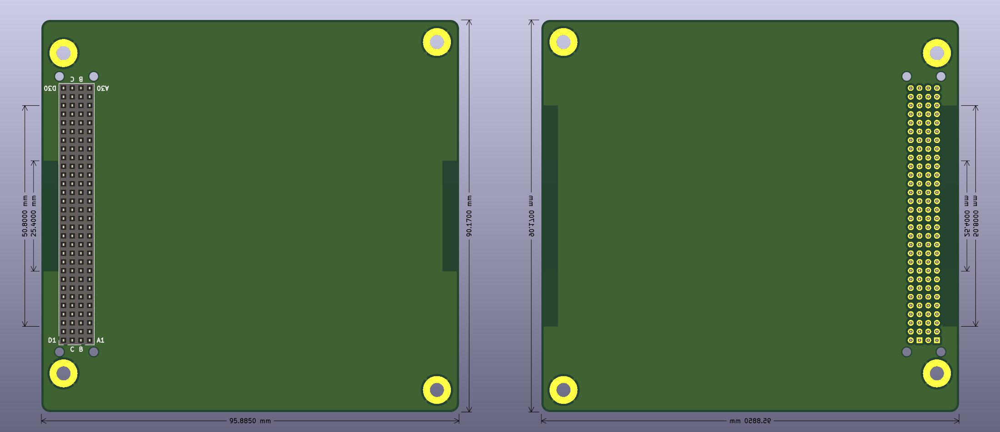

# PCI-104 Template for KiCad EDA

This is a [PCI-104](https://pc104.org/hardware-specifications/26-2/) compliant PCB template with the 4x30 P2.00mm socket and M3 mounting holes correctly positioned, as well as the recommended keep-out areas. No additional circuitry is present so you can build your own. Made with KiCad.

Read PC/104 Consortium's official specification in detail at https://pc104.org/wp-content/uploads/2015/02/PC104_Plus_v2_32.pdf (Note: this is actually the PC/104-Plus specification, difference being that PCI-104 lacks the 104-pin ISA bus connector)